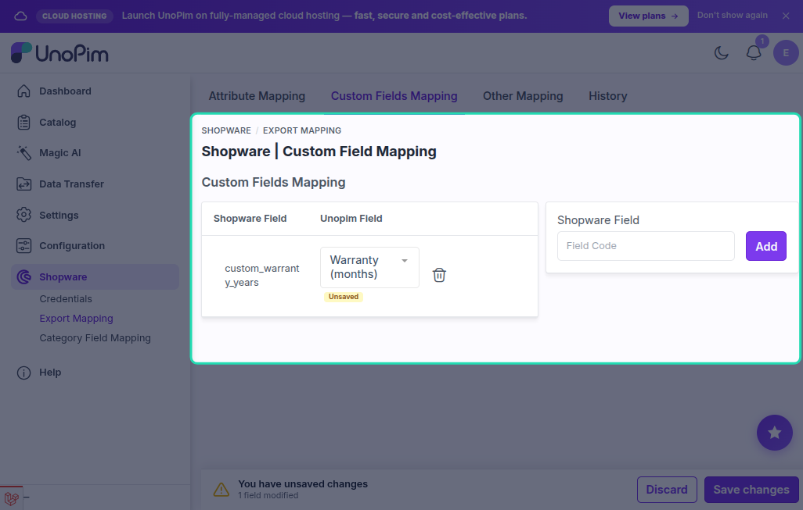

# Custom Fields Mapping

The **Custom Fields Mapping** screen lets you map UnoPim attributes to Shopware **custom fields** — arbitrary fields defined in your Shopware store that go beyond the standard product data model.

Go to **Shopware → Export Mapping → Custom Fields Mapping** in the UnoPim sidebar.

---

## When to Use Custom Fields Mapping

Use this mapping when:

- Your Shopware store has custom fields (e.g. `custom_material`, `custom_warranty_years`) defined at the product level.
- You store the corresponding data in UnoPim attributes and want it exported automatically.

This mapping is separate from the **Attribute Mapping** (standard fields) and the **Other Mapping** (images, properties, tags).

---

## Adding a Custom Field Pair

Each row in the mapping table links one Shopware custom field to one UnoPim attribute.

1. Click **Add Custom Field** at the top of the page.
2. Enter the **Shopware Field** code — the exact `snake_case` identifier of the Shopware custom field (e.g. `custom_warranty_years`).
3. Select the **UnoPim Field** — the UnoPim attribute whose value will be exported to that Shopware field.
4. Click **Save**.

> [!NOTE]
> The Shopware field code must match exactly what is defined in your Shopware custom field set. Field codes are case-sensitive and can only contain alphanumeric characters and underscores.

---

## Supported Attribute Types

You can map UnoPim attributes of the following types to Shopware custom fields:

| UnoPim Attribute Type | Exported as |
|---|---|
| **Text** | String value |
| **Textarea** | Multi-line string |
| **Number (text with number validation)** | Numeric value |
| **Select** | Single option value |
| **Multiselect** | Array of option values |
| **Date** | Date string |
| **Boolean** | `true` / `false` |

---

## Removing a Custom Field Mapping

To remove a pair, click the **Delete** icon next to the row. The custom field will no longer be populated during export.

---

## Saving

Click **Save** once all pairs are configured. The mapping is stored globally and applied to all product export jobs.
