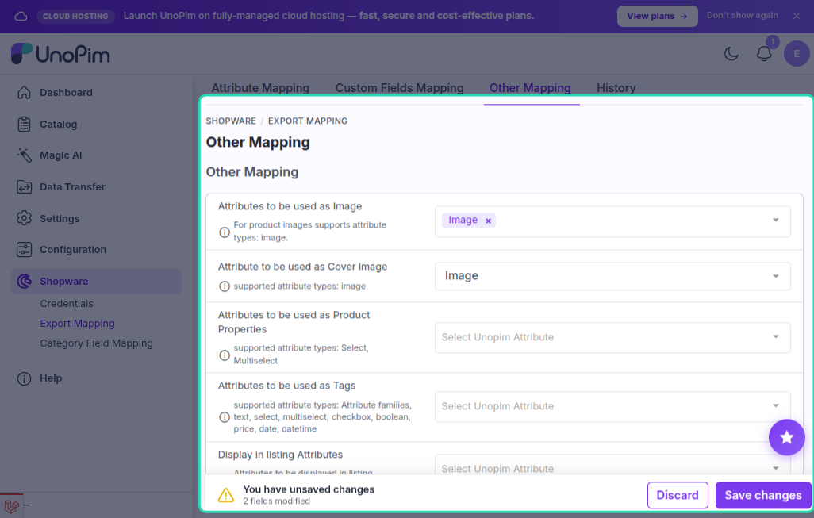

# Other Mapping

The **Other Mapping** screen controls how product images, cover images, properties, product tags, and configurable listing attributes are exported to Shopware.

Go to **Shopware → Export Mapping → Other Mapping** in the UnoPim sidebar.

---

## Product Images

Map one or more UnoPim **image** attributes to the product gallery in Shopware. Each mapped attribute's value is uploaded to Shopware as a media item and attached to the product.

- Select the UnoPim image attribute(s) you want to export as product gallery images.
- Multi-value image attributes are exported as a gallery (multiple images per product).

> **Supported attribute types:** Image

---

## Cover Image

Map a single UnoPim **image** attribute to be used as the product's **main (cover) image** in Shopware.

If a cover image attribute is mapped, the connector uploads that image first and sets it as the product thumbnail. Other images mapped under **Product Images** form the rest of the gallery.

> **Supported attribute types:** Image

---

## Properties

Map UnoPim `select` or `multiselect` attributes to Shopware **properties** (property-group options). When a product is exported, the connector sends the selected option values as Shopware properties linked to the product.

> **Supported attribute types:** Select, Multiselect

> [!NOTE]
> Attributes must be exported as **Shopware Attribute Options** first before they can be used as product properties. Run the **Shopware Attribute Options** export job before the product export.

---

## Tags

Map UnoPim attributes whose values will be exported as Shopware **product tags**. This can include:

- Standard text, select, or multiselect attributes
- Boolean attributes (the label of the attribute is exported when the value is `true`)
- Attribute-family names (the family name is added as a tag)

> **Supported attribute types:** Text, Select, Multiselect, Boolean, Price, Date, Datetime

> [!NOTE]
> Run the **Shopware Product Tags** export job to push the configured tag values to Shopware. Tags must exist in Shopware before products can reference them.

---

## Configurator Listing Attributes

For **configurable products**, map the UnoPim `select` attributes that control which variant option is shown in the **Shopware storefront listing** (the configurator selector). Only super-attributes (variant axes) are valid here.

> **Supported attribute types:** Select

---

## Saving

After configuring all sections, click **Save**. The settings apply to all relevant export jobs (product, configurable product, and tag jobs).
