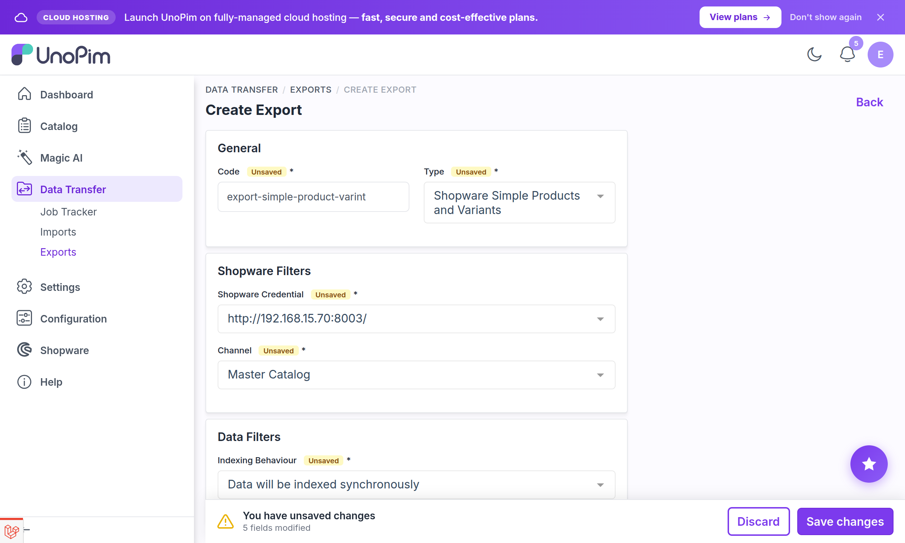
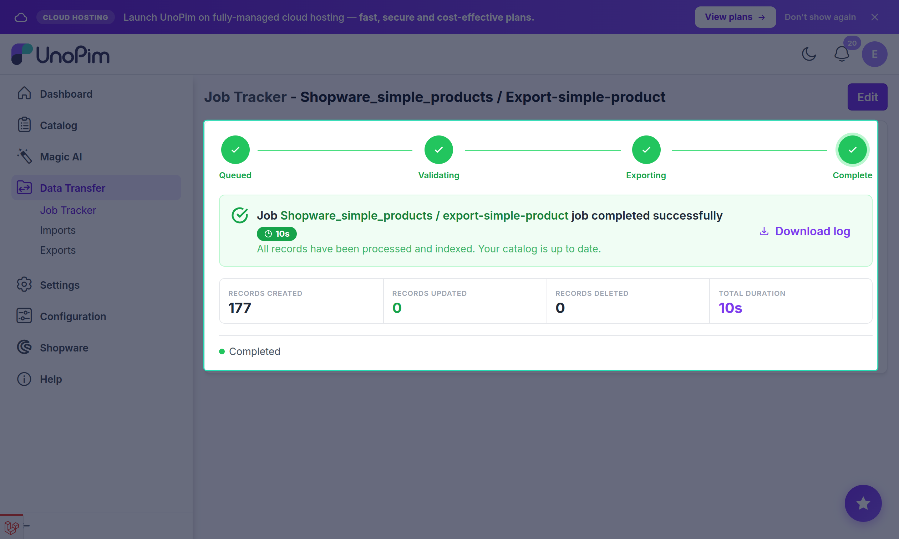

# Simple Product Export

The **Shopware Simple Products and Variants** export job pushes standalone products and product variants from UnoPim to Shopware.

Use this job for:
- Products that have no configurable (parent) relationship — simple products sold as-is.
- Variant products that are children of a configurable product already exported via the **Shopware Configurable Products** job.

---

## Prerequisites

Before running a simple product export:

- [Attribute Mapping](./attribute-mapping) must be configured — **Name**, **Product Number**, **Tax ID**, **Net Price**, **Gross Price**, and **Stock** must all have a mapped attribute or default value.
- Run [Shopware Categories](./category-export), [Shopware Attributes](./attribute-export), and [Shopware Attribute Options](./attribute-options-export) first if products reference categories or properties.
- Run [Shopware Product Tags](./product-tags-export) first if the product mapping uses tags.
- At least one active [credential](./credentials) must exist with locale and currency mappings configured.

---

## Open the Export Jobs Section

Go to:

`Data Transfer → Exports`

Click **Create Export** in the top-right corner.

---

## Create a Simple Product Export Job

While creating the export job:

1. Enter a unique **Export Job Code** (e.g. `shopware-simple-products`).
2. Select **Shopware Simple Products and Variants** as the export job type.

---

## Configure Filters

| Filter | Description |
|---|---|
| **Shopware Credential** | Select the Shopware store connection to export to. |
| **Channel** | Select the UnoPim channel whose product values should be read during export. |
| **Indexing Behaviour** | Controls how Shopware indexes the imported products after the bulk write. |

### Indexing Behaviour Options

| Option | Description |
|---|---|
| **Data will be indexed synchronously** | Shopware indexes products immediately after each bulk write (default). Suitable for smaller catalogs. |
| **Data will be indexed asynchronously** | Shopware queues the indexing to run in the background. Faster bulk write, but products may not be immediately searchable. |
| **Data indexing is completely disabled** | Shopware skips indexing entirely. Use only if you plan to trigger indexing manually afterward. |

---

## Save and Run

Click **Save Export** to create the job, then click **Export Now** to run it.

Monitor progress in the **Job Tracker**. The tracker reports:

- **Created** — new products added to Shopware.
- **Updated** — existing products whose data was refreshed.
- **Skipped** — products that could not be exported (e.g. missing required fields). Each skipped product is logged with a reason.

---

## What Gets Exported

For each eligible product, the connector sends:

- All fields configured in [Attribute Mapping](./attribute-mapping) (name, product number, tax, prices, stock, description, etc.).
- **Images** — uploaded to Shopware and attached as a media gallery.
- **Cover image** — set as the product's main thumbnail.
- **Properties** — attribute values for mapped `select` / `multiselect` attributes.
- **Custom fields** — values for any pairs configured in [Custom Fields Mapping](./custom-mapping).
- **Translations** — field values in every mapped locale.
- **Multi-currency prices** — price entries for every currency pair in the credential.

---

## Re-Running the Job

Running the same job again performs an **upsert** — existing products in Shopware are updated, not duplicated. The connector uses a stored ID mapping table to match UnoPim products to their Shopware counterparts.

> [!WARNING]
> A product missing a **required field** (Product Number, Tax ID, Net Price, Gross Price, or Stock) is **skipped** rather than failing the entire batch. Check the Job Tracker log for skipped products and their error messages.
