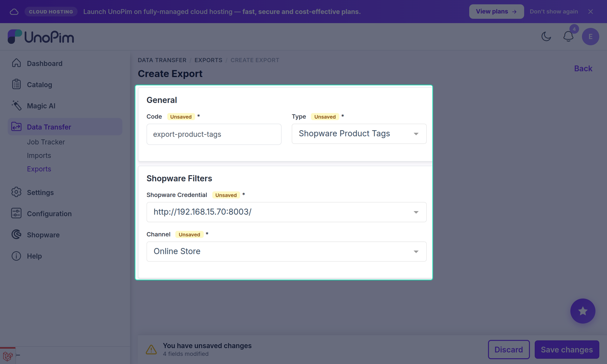

# Product Tags Export

The **Shopware Product Tags** export job pushes product attribute values, boolean flags, and attribute-family names from UnoPim to Shopware as **product tags**.

Run this job **before** the product export jobs when tags are configured in [Other Mapping → Tags](./other-mapping).

---

## What Are Product Tags in Shopware?

In Shopware, product tags are flat text labels attached to a product. They are used for filtering, search, and internal categorization. The connector creates these tags in Shopware and links them to the corresponding products.

---

## What Gets Exported as Tags

The connector supports the following sources for tag values:

| Source | How it becomes a tag |
|---|---|
| **Text attribute** | The attribute value is exported as a tag label. |
| **Select / Multiselect attribute** | Each selected option label is exported as a separate tag. |
| **Boolean attribute** | When the value is `true`, the attribute label is exported as a tag. |
| **Price attribute** | The price value string is exported as a tag. |
| **Date / Datetime attribute** | The date string is exported as a tag. |
| **Attribute family name** | The name of the UnoPim product family is exported as a tag. |

Configure which attributes and families contribute to tags in **Shopware → Export Mapping → Other Mapping → Tags**.

---

## Open the Export Jobs Section

Go to:

`Data Transfer → Exports`

Click **Create Export** in the top-right corner.

---

## Create a Product Tags Export Job

1. Enter a unique **Export Job Code** (e.g. `shopware-product-tags`).
2. Select **Shopware Product Tags** as the export job type.

---

## Configure Filters

| Filter | Description |
|---|---|
| **Shopware Credential** | Select the Shopware store to export to. |
| **Channel** | Select the UnoPim channel whose product values are read for tag export. |

---

## Save and Run

Click **Save Export**, then click **Export Now**.

Monitor progress in the **Job Tracker**.

> [!NOTE]
> The **Other Mapping → Tags** section must be configured before this job will export any tag data. If no tag attributes are mapped, the job will complete without sending any tags.

---

## Re-Running the Job

The job uses an upsert approach — re-running it updates tag associations and adds any new tags without creating duplicates. Tags that were previously associated but no longer match a product's attribute values may need to be cleaned up manually in Shopware.
