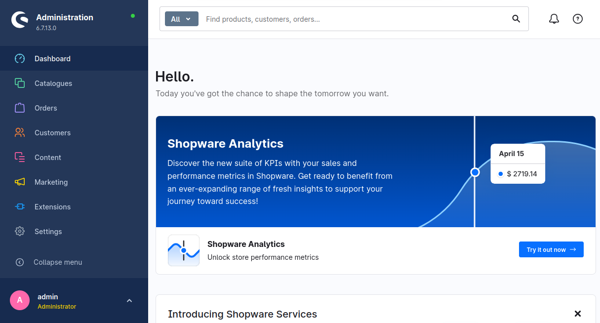
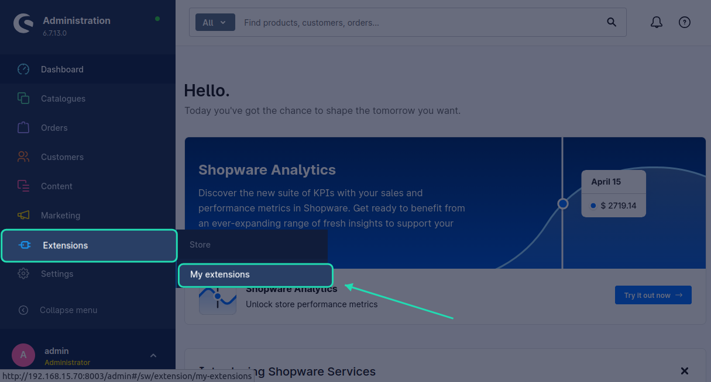
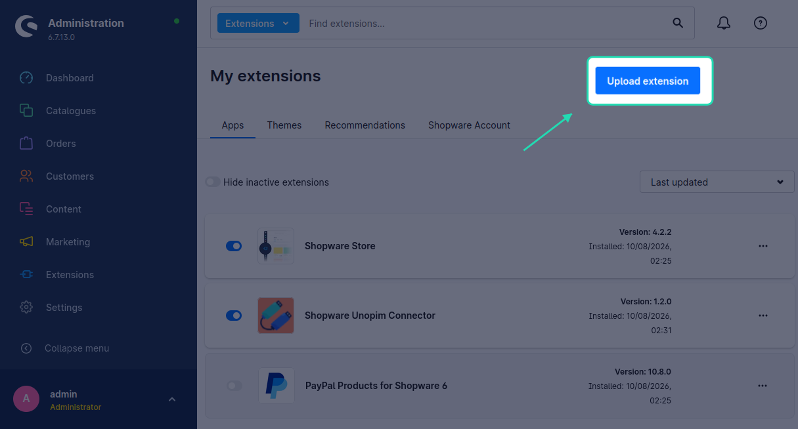
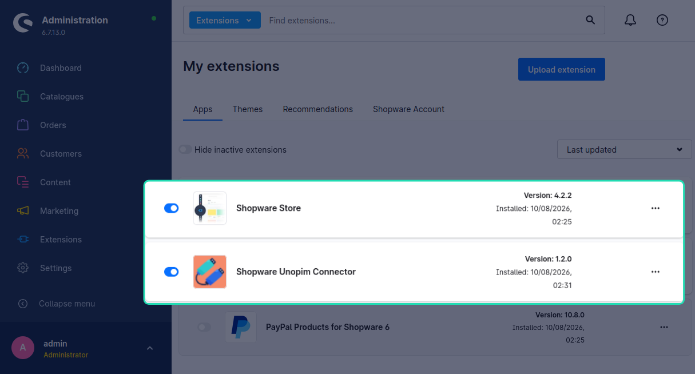
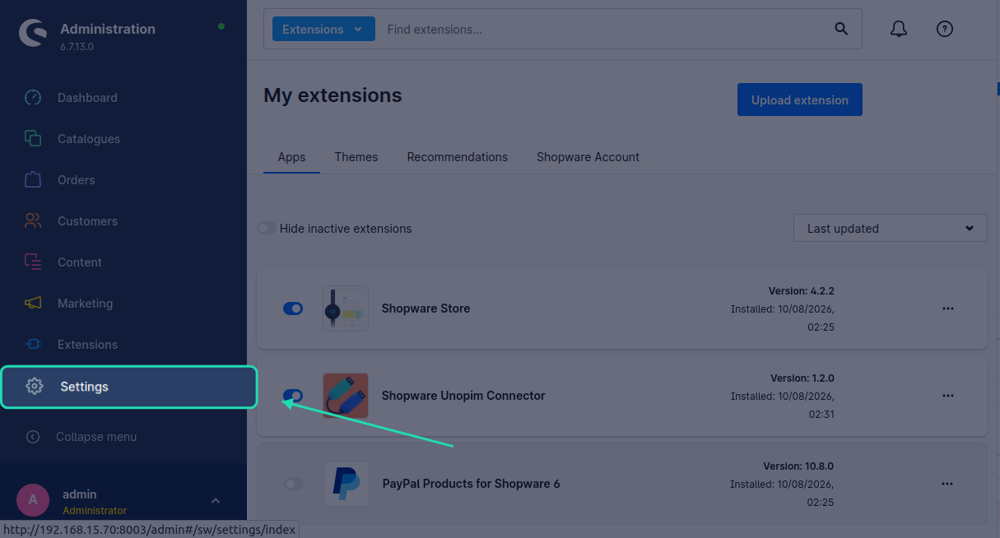
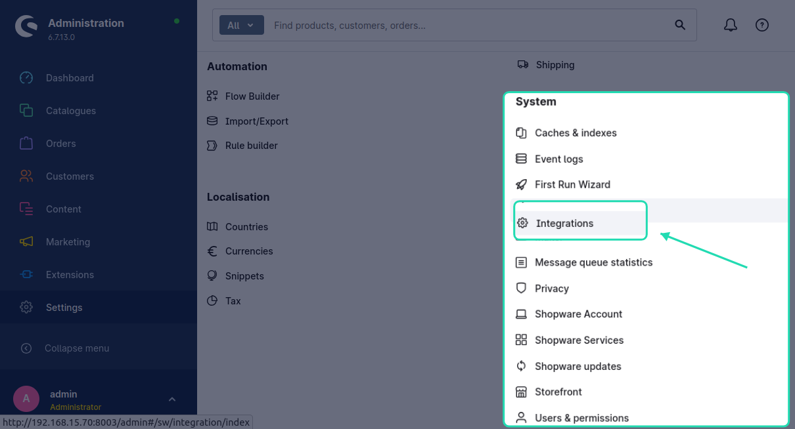
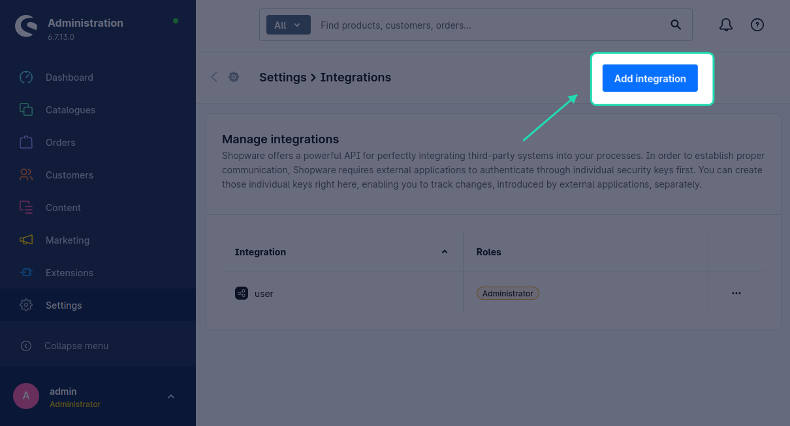
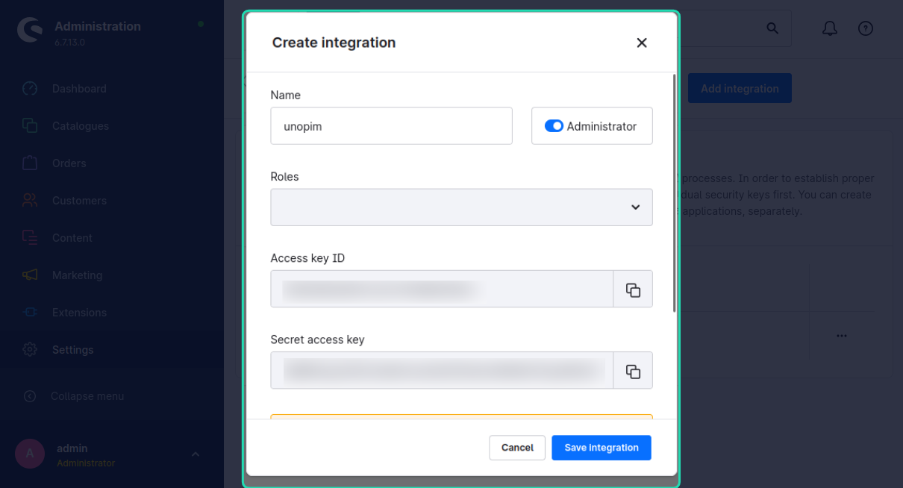

# Before You Begin — Shopware Bulk API Plugin

The UnoPim Shopware Connector uses a **custom Bulk API plugin** to write products, media, and tags to Shopware efficiently. This plugin must be installed in your Shopware instance before you run any export job.

The plugin ZIP file (`ShopwareBulkApi.zip`) is included in the connector package.

---

## Step 1 — Log in to your Shopware Admin

Open your Shopware store's admin panel and log in with an administrator account.

---

## Step 2 — Open My Extensions

In the left sidebar, go to **Extensions → My Extensions**.

---

## Step 3 — Upload the Plugin

Click **Upload Extension** at the top of the page.

Select the `ShopwareBulkApi.zip` file from the connector package and upload it.

---

## Step 4 — Install and Activate the Plugin

Once the plugin appears in the list, click **Install**. After installation completes, toggle the plugin to **Active**.

---

## Step 5 — Create an Integration

The connector authenticates using a Shopware **Integration** (not a user account). Integrations use the OAuth2 client-credentials grant.

1. In the Shopware admin, go to **Settings → System → Integrations**.

2. Click **Add integration**.

3. Give the integration a descriptive name (e.g. **UnoPim Connector**).

4. Under **Permissions**, enable the following:

| Permission area | Access level |
|---|---|
| Products | Read & Write |
| Categories | Read & Write |
| Tags | Read & Write |
| Media | Read & Write |
| Tax | Read |
| Delivery times | Read |
| Units | Read |
| Currencies | Read |
| Languages | Read |
| Sales channels | Read |

5. Click **Save**.

After saving, Shopware will display the **Access key ID** and **Secret access key** for the integration. Copy both values — you will need them when creating credentials in UnoPim.

> [!IMPORTANT]
> The Secret access key is shown only once. Copy it now and store it in a safe place before closing the dialog.

You are now ready to install the connector in UnoPim. Continue to [Installation](./installation).
