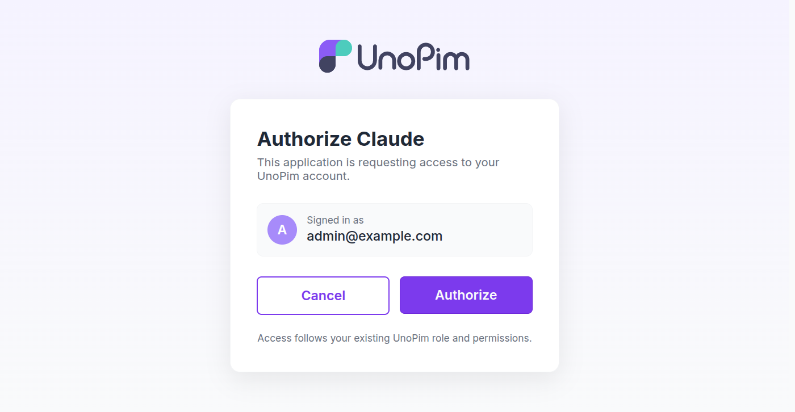

# Connect Claude as a Custom Connector

Add UnoPim to claude.ai once, and Claude can work on your catalog in any conversation.

You don't create an app, a client ID or a secret. Claude sets all of that up itself from your web address — you just log in and approve.

## Before you start

- UnoPim installed and reachable at a **public `https://` address**. Claude connects from the internet, so `localhost` won't work.
- The [MCP package installed](./installation).
- The OAuth keys generated:

  ```bash
  php artisan passport:keys
  ```

---

## Step 1 — Add the connector in claude.ai

Go to **Settings → Connectors → Add custom connector**, and enter your UnoPim address followed by `/mcp/unopim`:

```
https://your-unopim-site/mcp/unopim
```

## Step 2 — Log in to UnoPim

Claude sends you to your own UnoPim login page. Sign in as the admin you want Claude to act as.

> [!IMPORTANT]
> Claude gets exactly the same permissions as the account you log in with. Log in as the person you'd be comfortable letting Claude work as.

## Step 3 — Approve the request

You'll see this screen:

<br>



<br>

Check the account shown, then press **Authorize**. You're taken back to claude.ai, connected.

## Step 4 — Try it

Start a new conversation and ask:

> *"Read my UnoPim catalog schema and tell me how many filterable attributes I have."*

If Claude answers with your real attributes, you're done.

---

## What Claude can do

Claude works within the role of the account you logged in with. If that person can't edit attributes in UnoPim, Claude can't either.

There's also a limit of 60 requests per minute per tool, and every change Claude makes is written to your log with the account, the tool and what it changed.

> [!CAUTION]
> Don't connect using an account with the **Settings** permission unless you mean to. That permission unlocks the developer tools, which can create files and run commands on your server.

See [Security & Permissions](./security) for what each permission unlocks.

## Disconnecting

Remove the connector in claude.ai, or delete its access tokens in UnoPim. Either way Claude loses access immediately.

To connect as a different admin, remove the connector, log in to UnoPim as the account you want, and add it again.

## Using Claude Code instead?

If you work in a terminal, connect the local server in one command:

```bash
claude mcp add unopim-dev -- php artisan mcp:start unopim-dev
```

Or point Claude Code at the same remote address:

```bash
claude mcp add --transport http unopim https://your-unopim-site/mcp/unopim
```

## Next steps

- [What you can ask for](./workflows)
- [The full tool list](./tool-reference)
- [Something not working?](./troubleshooting)
