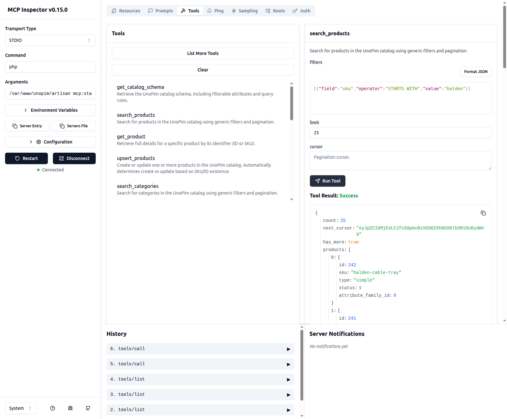

# Connect an AI Client

Pick the section for your tool. Connecting to claude.ai is covered separately on [Connect Claude](./claude).

Two addresses are used throughout:

| | |
|---|---|
| **Local** | `php artisan mcp:start unopim-dev` |
| **Remote** | `https://your-unopim-site/mcp/unopim` |

Use local when the assistant runs on your own computer, remote when it runs online.

## Claude Code

```bash
claude mcp add unopim-dev -- php artisan mcp:start unopim-dev
```

Type `/mcp` in Claude Code to confirm it connected.

## VS Code · GitHub Copilot

Create `.vscode/mcp.json` in your project:

```jsonc
{
    "servers": {
        "unopim-dev": {
            "command": "php",
            "args": ["artisan", "mcp:start", "unopim-dev"],
            "cwd": "/path/to/your/unopim"
        }
    }
}
```

> [!IMPORTANT]
> `cwd` must be the folder that contains `artisan`. Getting this wrong is the most common reason a connection fails.

## Cursor

Go to **Preferences → Models → MCP** and add a server:

- **Type**: `command`
- **Command**: `php artisan mcp:start unopim-dev`
- **Working directory**: your UnoPim folder

## Windsurf

Edit `~/.windsurf/mcp.json`:

```jsonc
{
    "servers": {
        "unopim-dev": {
            "command": "php",
            "args": ["artisan", "mcp:start", "unopim-dev"],
            "cwd": "/path/to/your/unopim"
        }
    }
}
```

## claude.ai

Claude connects over the internet and logs in through UnoPim. See [Connect Claude](./claude) for the four steps.

## MCP Inspector

A test tool that connects the same way an AI client does — useful for checking UnoPim itself is working:

```bash
php artisan mcp:inspector unopim-dev
```

Press **Connect**, then browse the **Tools** tab.



## Local and remote are not the same

| | Local | Remote |
|---|---|---|
| **Login needed** | No | Yes |
| **Permissions checked** | No | Yes |

Running locally means you already have access to the server, so there's nothing extra to check. Remote connections always log in and always follow the account's permissions. See [Security & Permissions](./security).

## Next steps

- [What you can ask for](./workflows)
- [The full tool list](./tool-reference)
- [Something not connecting?](./troubleshooting)
