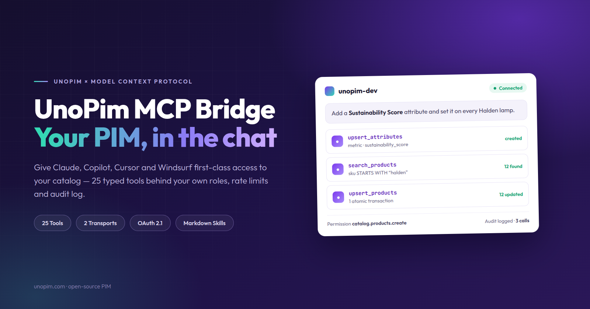
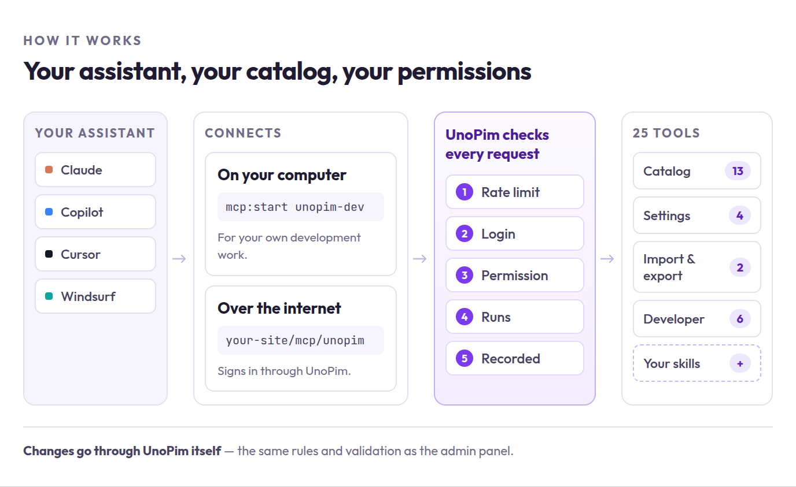

# UnoPim MCP Bridge

The **UnoPim MCP Bridge** connects AI assistants like Claude, GitHub Copilot, Cursor and Windsurf to your catalog. Once connected, you can ask them to find products, add attributes, fix categories or check a failed import — in plain language, without opening the admin panel.

 

  

 

## What it does

Instead of guessing, the assistant gets **25 real tools** it can use on your catalog:

| It can | Examples |
|---|---|
| **Read your catalog** | *"Which products have no description?"* |
| **Make changes** | *"Add a Material attribute with options Cotton, Silk and Wool."* |
| **Check on jobs** | *"Did last night's import finish, and what failed?"* |
| **Help developers** | *"Scaffold a connector plugin called ShipStation."* |

Everything runs through your existing **roles and permissions**. The assistant can never do more than the person who connected it.

## How it fits together

 

 

There are two ways to connect, and you pick based on where your assistant runs:

| | Use this when | How |
|---|---|---|
| **Local** | The assistant runs on your own computer | `php artisan mcp:start unopim-dev` |
| **Remote** | The assistant runs online, like claude.ai | `https://your-site/mcp/unopim` |

## Requirements

| | |
|---|---|
| **UnoPim** | 3.0.0 |
| **PHP** | 8.4.1+ |
| **Laravel** | 13 |
| **Database** | MySQL 8.0+ or PostgreSQL 16+ |

## Get started

1. [Install the package](./installation)
2. [Connect Claude](./claude) — or [another AI client](./connect-a-client)
3. [See what you can ask for](./workflows)
