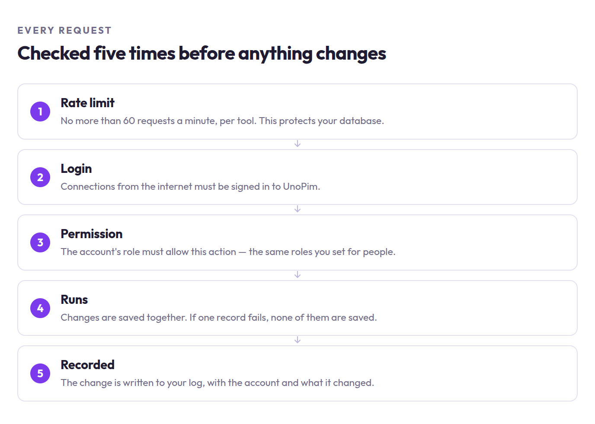

# Security & Permissions

The assistant never gets its own account. It borrows the permissions of the person who connected it — so it can do exactly what they can do, and nothing more.

## What happens on every request

 

 

| Check | What it means |
|---|---|
| **Rate limit** | No more than 60 requests a minute, per tool. Protects your database. |
| **Login** | Remote connections must be signed in. |
| **Permission** | The account's role must allow this action. |
| **Recorded** | Every change is written to your log with who did it and what changed. |

## Who can do what

Set this in **Settings → Roles** in UnoPim, the same way you would for a person.

| Permission | Lets the assistant |
|---|---|
| **Catalog** | Look up families, groups, currencies and import jobs |
| **Products** | Search and view products |
| **Products › Create** | Add and edit products |
| **Categories** (+ Create) | Search, add and edit categories |
| **Attributes** (+ Create) | Search, add and edit attributes |
| **Settings** | Everything above, **plus the developer tools** |

> [!CAUTION]
> **Settings is the one to be careful with.** It unlocks every tool, including the developer tools that can create files and run commands on your server. Only connect with a Settings account if that's what you intend.

A good starting point for a catalog team: **Products**, **Products › Create**, **Categories** and **Attributes**. That covers day-to-day catalog work without touching anything else.

## Local connections are different

When the server runs on your own computer (`php artisan mcp:start`), permissions aren't checked. That's deliberate — you already have access to the machine and the files, so a permission check wouldn't be protecting anything.

It does mean you shouldn't run the local server on a shared machine other people can use. For anyone who isn't you, use the remote connection, which always checks.

## Developer tools are fenced in

If you do grant Settings, the developer tools still have limits:

- **Files** — only your project folder and the temp folder. Set in `allowed_paths`, see [Configuration](./configuration).
- **Commands** — only `php artisan` and `composer`. Nothing else runs.
- **Database queries** — read-only. It can look, but never change or delete.

## Before going live

- Serve UnoPim over **HTTPS**.
- Keep `MCP_API_AUTH=true`.
- Keep `MCP_AUDIT_LOGGING=true`, and make sure your logs are kept long enough to be useful.
- Review who has the **Settings** permission.
- Review anything in `.ai/skills/` — [skills](./skills) become things the assistant can run.

## Next steps

- [Configuration](./configuration)
- [The full tool list](./tool-reference)
