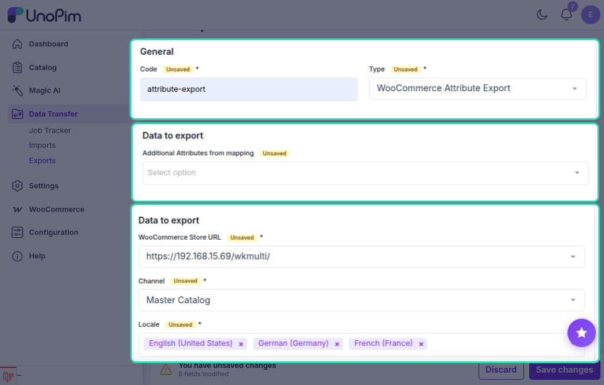
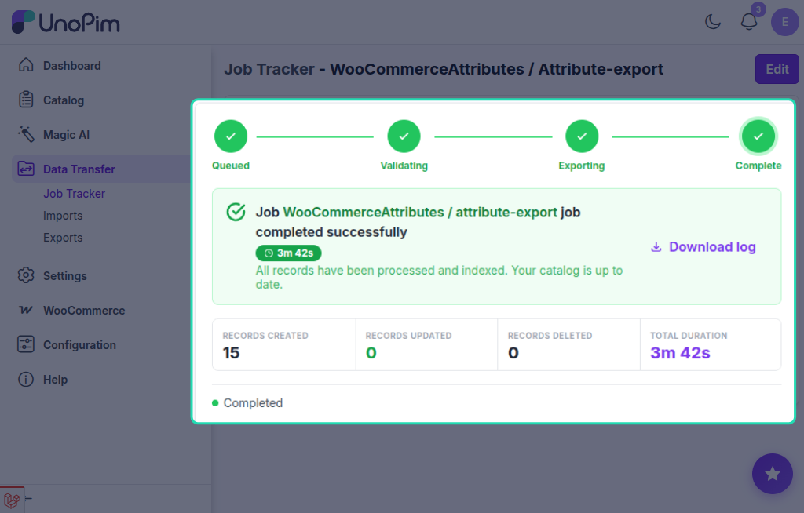

# Attribute Export

The UnoPim WooCommerce WPML addon allows users to export attribute data from UnoPim to WooCommerce in multiple languages simultaneously through dedicated WPML-aware export jobs.

::: info
The Locale field is a multiselect — you can select multiple languages in a single job run. Each selected locale will be pushed as a separate WPML translation of the attribute in WooCommerce.
:::

## Step 1 — Open the Export Jobs Section

To create an attribute export job, go to:

`Data Transfer > Exports`

From the Exports page, click **Create Export** in the top-right corner.

## Step 2 — Create an Attribute Export Job

While creating the export job, the user needs to:

- Enter the **Export Job Code**.
- Search for and select **WooCommerce Attributes** as the export job type.

## Step 3 — Configure Attribute Export Filters

After selecting the job type, configure the following fields:

| Field | Type | Required | Description |
|---|---|---|---|
| Credential | Select | Yes | The WooCommerce credential that has **Enable WPML Export** turned on. Make sure the credential's WPML Settings are configured before running this job. |
| Channel | Select | Yes | The UnoPim channel to use for the export. |
| Locale | Multiselect | Yes | One or more UnoPim locales to export. Each selected locale is exported as a separate WPML language translation of the attribute. The default locale defined in the credential's WPML Settings is treated as the base (original) attribute. |
| Attributes | Multiselect | No | Limit the export to specific UnoPim attributes. Leave empty to export all attributes available in the selected channel. |

::: warning
Make sure each locale you select has a corresponding WPML language configured in WordPress. Exporting to a locale with no matching WPML language will fail.
:::

## Step 4 — Save and Run the Export Job

After filling in the required fields, click **Save Export** to save the job.

To run the job, open it from the Exports list and click **Run**. You can monitor progress from the **Job Tracker**.

After the export completes successfully, the selected attributes and their WPML translations will be available in the connected WooCommerce store under **Products → Attributes**, with each language entry linked through WPML.
