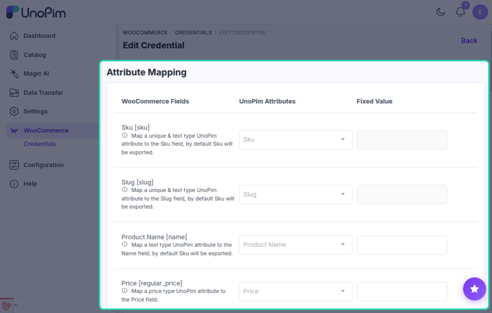
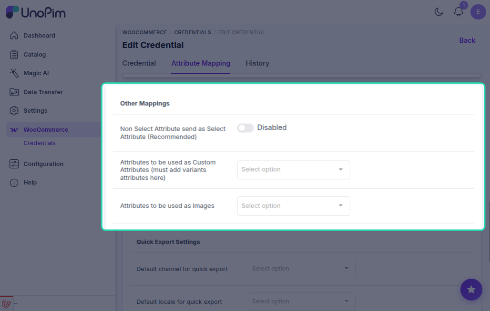
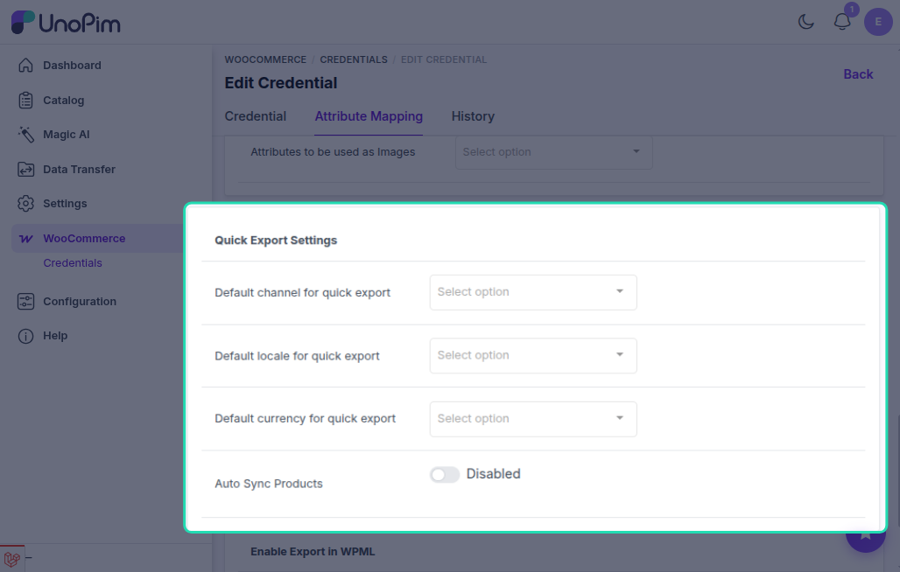
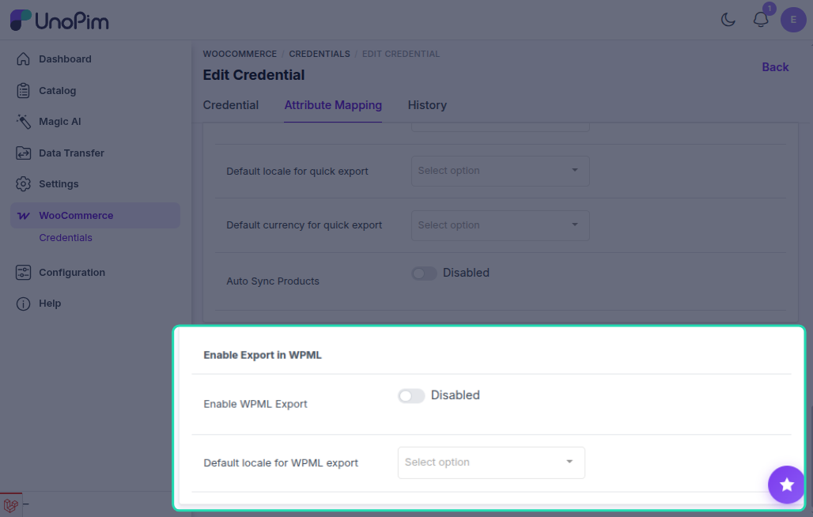

# Attribute Mapping

Attribute mapping connects UnoPim attributes to WooCommerce product fields. This tells the connector which UnoPim attribute to use for each WooCommerce field (name, price, description, etc.) during export and import.

Go to **WooCommerce → Credentials**, open a credential, and click the **Attribute Mapping** tab.

## Standard Field Mapping

Map each WooCommerce field to the matching UnoPim attribute:

| WooCommerce Field | Description |
|---|---|
| **SKU** `[sku]` | Unique product identifier |
| **Product Name** `[name]` | Title shown to customers |
| **Price** `[regular_price]` | Standard selling price |
| **Description** `[description]` | Full product description |
| **Short Description** `[short_description]` | Brief product summary |
| **Weight** `[weight]` | Used for shipping |
| **Length / Width / Height** | Dimensions for packaging |
| **Quantity** `[stock_quantity]` | Available stock (map to a text attribute) |
| **Slug** `[slug]` | URL-friendly product name |

## Additional Meta Keys

To map custom WooCommerce fields, enter the field code under **Additional Meta Keys** and press Enter, then assign a UnoPim attribute to it.

## Other Mappings

| Option | Description |
|---|---|
| **Non-Select attribute sent as Select** | Enable when a WooCommerce field should be treated as a select-type value |
| **Attribute used as custom attribute** | Defines which UnoPim attributes are sent as WooCommerce custom attributes. Variant attributes must be added here. |
| **Attribute used as Images** | Selects the UnoPim attribute to use for product images |

## Quick Export Settings

Configure default values used by quick export jobs:

| Field | Description |
|---|---|
| **Default Channel** | Channel used when quick-exporting products |
| **Default Locale** | Locale used for quick exports |
| **Default Currency** | Currency used for quick exports |
| **Auto Sync Products** | When enabled, product creates, updates, and deletes in UnoPim are automatically pushed to WooCommerce |

## WPML Export Settings

This section is added by the WooCommerce WPML add-on. It appears at the bottom of the Attribute Mapping tab.

| Setting | Description |
|---|---|
| **Enable WPML Export** | Toggle **on** to activate multi-locale WPML mode for this credential. When off, exports use standard single-locale WooCommerce behaviour. |
| **Default Locale** | The UnoPim locale treated as the original language. All other locales selected in an export job become WPML translations of it. Must match the default language configured in WPML on WordPress. |

::: warning
Enable WPML Export only after WPML is installed and configured in WordPress. Enabling it without WPML active will cause export jobs to fail.
:::

Click **Save** after completing all mapping sections.
