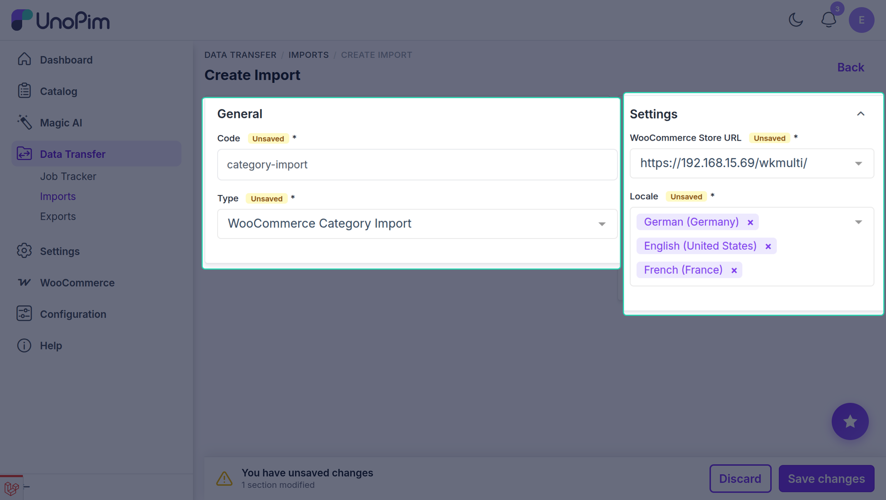
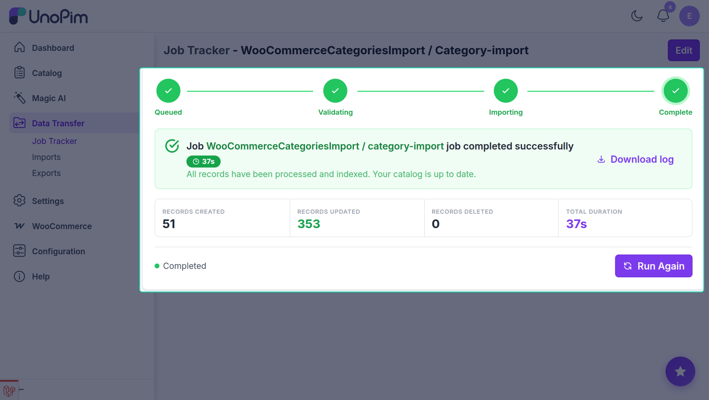

# Category Import

The UnoPim WooCommerce WPML addon allows users to import WooCommerce categories into UnoPim in multiple languages simultaneously. Each selected locale is imported as a separate locale value on the UnoPim category record.

::: info
The Locale field is a multiselect — you can select multiple languages in a single job run. Each selected locale will be pulled as a separate WPML translation and stored under the corresponding locale in UnoPim.
:::

## Step 1 — Open the Import Section

To create a category import job, go to:

`Data Transfer > Imports`

From there, click **Create Import** to open the import setup form.

## Step 2 — Create a Category Import Job

While creating the import job, the user needs to:

- Enter the **Code**.
- Search for and select **WooCommerce Categories Import** as the import type.

## Step 3 — Configure Category Import Settings

Under **Settings**, configure the following fields:

| Field | Type | Required | Description |
|---|---|---|---|
| Credential | Select | Yes | The WooCommerce credential that has **Enable WPML Export** turned on. The addon uses WPML's API to fetch each language's category translations from WooCommerce. |
| Locale | Multiselect | Yes | One or more UnoPim locales to import. For each selected locale, the addon fetches the matching WPML translation from WooCommerce and writes it to the corresponding locale on the UnoPim category. |

## Step 4 — Save and Run the Import Job

After entering the required values, click **Save Import** to save the import profile.

To run the job, open it from the Imports list and click **Run**. Once the job executes, the imported categories will be available in UnoPim with each selected locale populated.

