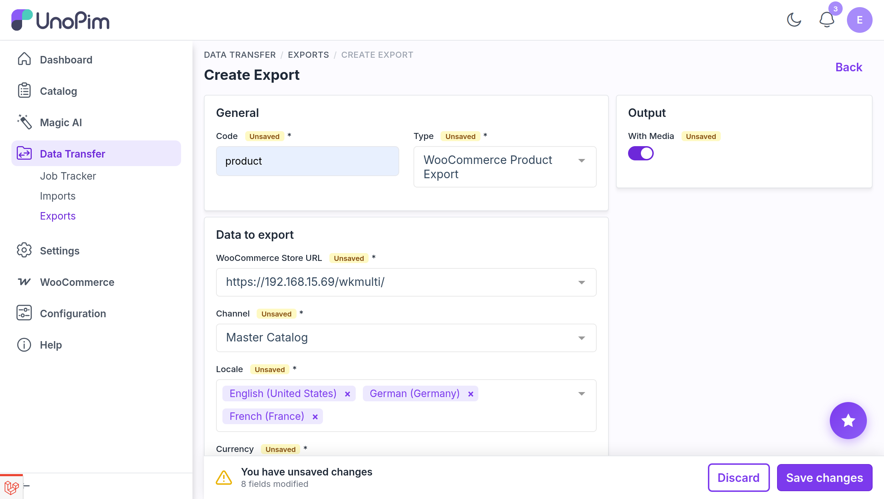

# Product Export

The UnoPim WooCommerce WPML addon allows users to export product data from UnoPim to WooCommerce in multiple languages simultaneously. Each locale you select is exported as a separate WPML translation linked to the base product.

::: info
The Locale field is a multiselect — you can select multiple languages in a single job run. Each selected locale will be pushed as a separate WPML translation of the product in WooCommerce. The locale set as **Default Locale** in the credential's WPML Settings is treated as the original product; all other selected locales become translations of it.
:::

## Step 1 — Open the Export Jobs Section

To create a product export job, go to:

`Data Transfer > Exports`

From the Exports page, click **Create Export** in the top-right corner.

## Step 2 — Create a Product Export Job

While creating the export job, the user needs to:

- Enter the **Export Job Code**.
- Search for and select **WooCommerce Product** as the export job type.

## Step 3 — Configure Product Export Filters

After selecting the job type, configure the following fields:

| Field | Type | Required | Description |
|---|---|---|---|
| Credential | Select | Yes | The WooCommerce credential that has **Enable WPML Export** turned on. Make sure the credential's WPML Settings are configured before running this job. |
| Channel | Select | Yes | The UnoPim channel to use for the export. |
| Locale | Multiselect | Yes | One or more UnoPim locales to export. Each selected locale is exported as a separate WPML language translation of the product. The default locale defined in the credential's WPML Settings is treated as the base (original) product. |
| Currency | Select | Yes | The currency to use for product pricing during export. |
| Product SKU | Multiselect | No | Limit the export to specific products by their UnoPim SKU. Leave empty to export all products in the selected channel. |
| With Media | Boolean | No | Enable this option if product images should also be exported to WooCommerce alongside the product data. |

::: warning
Make sure each locale you select has a corresponding WPML language configured in WordPress. Exporting to a locale with no matching WPML language will fail.
:::

## Step 4 — How Variants Are Exported

For products that have variants (configurable products), each variation is exported per locale with a language suffix appended to its SKU. For example, a variant with SKU `shirt-red-large` exported for the `de_DE` locale will be created in WooCommerce with SKU `shirt-red-large-de-de`.

Each translated variation is exported with its WPML `translation_of` field set to the corresponding default-locale variation. This tells WPML that the translated variation is a language copy of the base variation, keeping them correctly linked across all languages.

## Step 5 — Save and Run the Export Job

After filling in the required fields, click **Save Export** to save the job.

To run the job, open it from the Exports list and click **Run**. You can monitor progress from the **Job Tracker**.

<!--  -->

After the export completes successfully, the products and their WPML translations will be visible in the connected WooCommerce store. Each product will show its translated versions in the WPML translation panel on the product edit screen.
