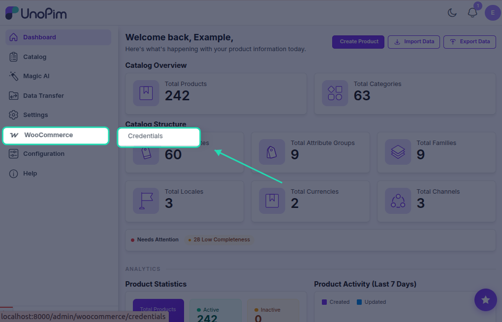
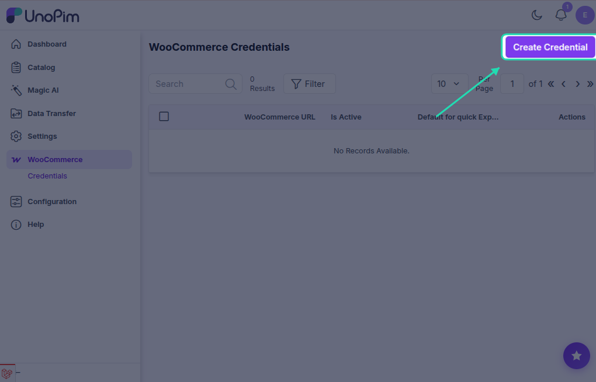
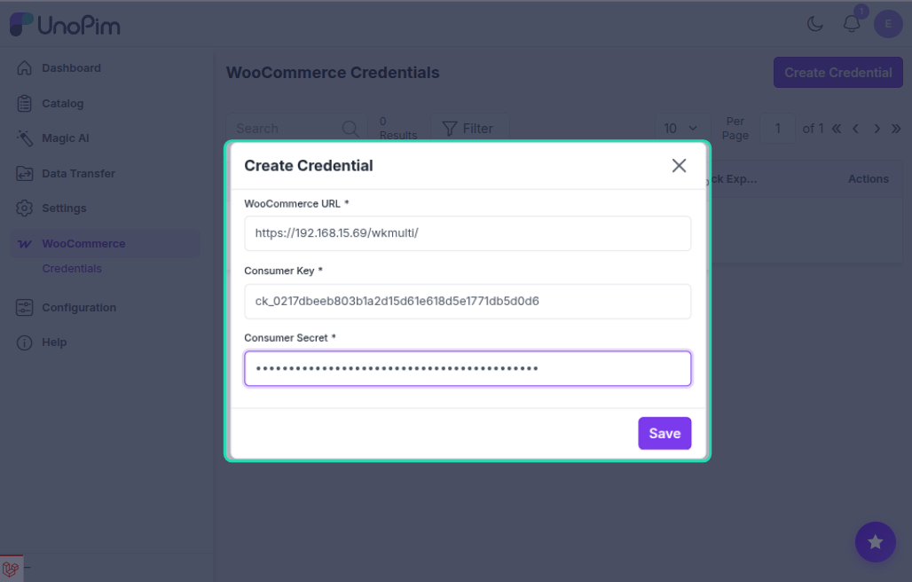

# Setup Credentials

The WooCommerce WPML add-on uses the same credentials as the WooCommerce Connector — there is no separate credential screen. You configure the credential once inside **WooCommerce → Credentials** and the WPML add-on picks it up automatically.

## Step 1 — Open Credentials

In the UnoPim admin panel, go to:

`WooCommerce → Credentials → Create`

## Step 2 — Fill in the Store Details

Enter the following details:

| Field | Description |
|---|---|
| **WooCommerce URL** | Full URL of your WooCommerce store (e.g. `https://mystore.com`) |
| **Consumer Key** | The key generated from WooCommerce → Settings → Advanced → REST API |
| **Consumer Secret** | The secret generated alongside the Consumer Key |

> **Need the API keys?** See [Generating WooCommerce API Credentials](/woocommerce/api-credentials) for step-by-step instructions on creating them in WordPress.

## Step 3 — Save and Test

Click **Save**. The connector will test the connection automatically. A green status indicator confirms the credential is active and working.

::: warning
The API key must have **Read/Write** permission in WooCommerce. A Read-only key will cause all export jobs to fail.
:::

## Step 4 — Configure Attribute Mapping

After saving the credential, open it and go to the **Attribute Mapping** tab to map UnoPim attributes to WooCommerce fields and enable WPML export mode. See [Attribute Mapping](./attribute-mapping) for details.
