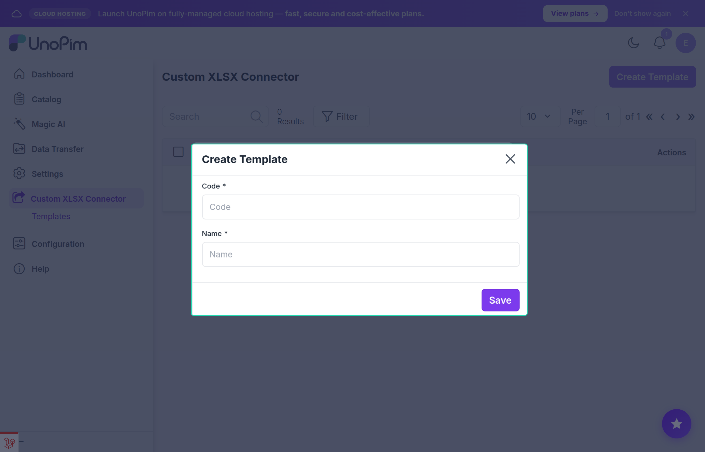
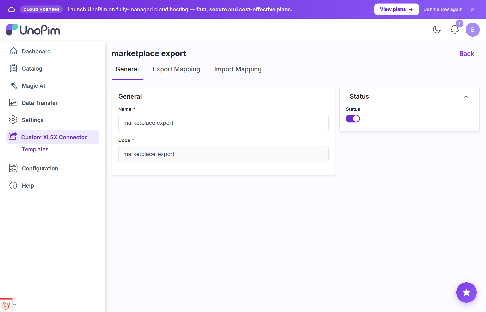
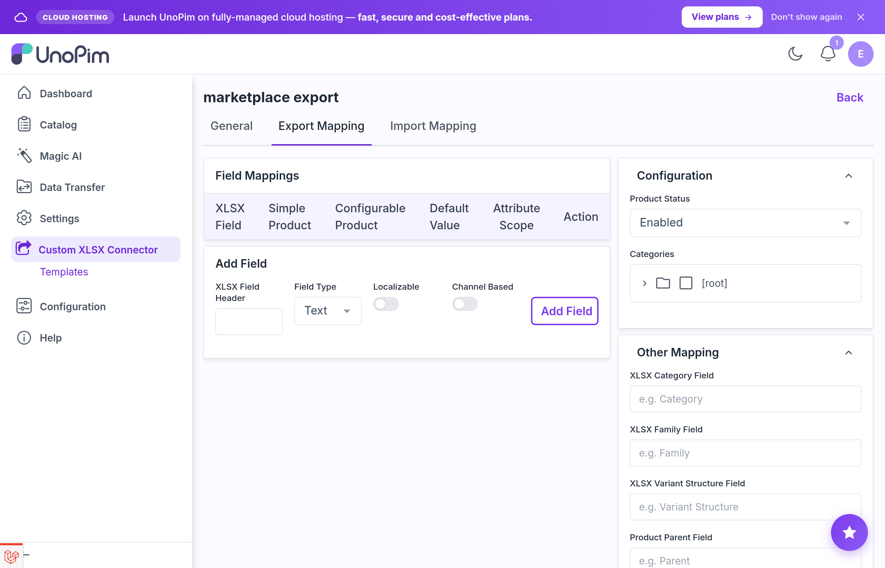
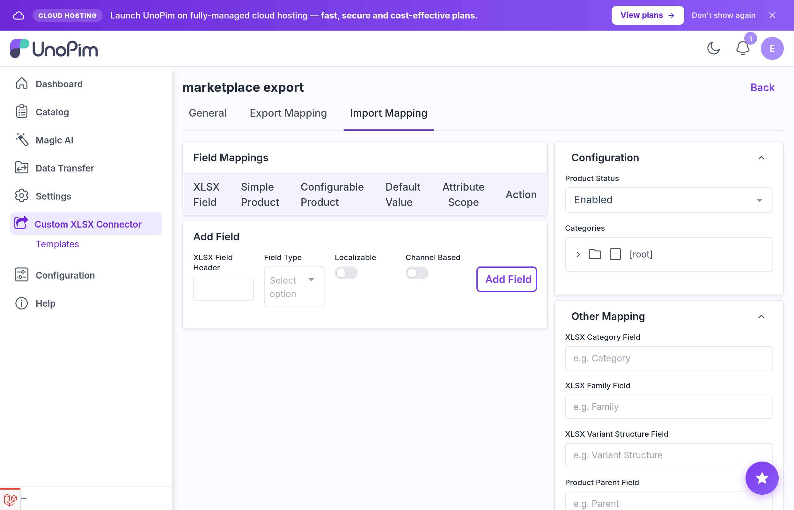

# Author Guide — Managing Templates

A **Template Author** is any admin user with permission to create and edit templates. Authors create and maintain the mapping templates that import/export jobs use. Operators who run those jobs do not need to understand the spreadsheet's column structure as long as the template is correctly set up.

## Opening the module

In the admin panel, click **Custom XLSX Connector → Templates** in the sidebar. From the listing you can:

- create a new template
- search, filter, and sort saved templates by code, name, and status
- click any row to open its edit page
- use the row-level actions to edit, delete, or toggle status
- select multiple rows for bulk enable/disable or bulk delete

## Three-step workflow

1. **Create a Mapping Template** — define how XLSX columns map to UnoPim attributes (this guide).
2. **Configure an Import/Export Job** — create a Data Transfer job that uses the template.
3. **Run the Job** — execute the import or export.

Steps 2 and 3 are covered in the [Operator Guide](./operator-guide).

## Creating a template

### Step 1 — Open the create form

Click **Create Template** on the Templates listing page. Enter a **Name** and a **Code**, then save to open the full template editor.

| Field | Required | Notes |
|---|---|---|
| **Name** | Yes | Human-readable label shown in job dropdowns |
| **Code** | Yes | Unique identifier; letters, numbers, hyphens, and underscores only — cannot be changed after saving |

Use descriptive, namespaced codes:

```
products-vendor-acme
erp-monthly-feed
marketplace-export
```



### Step 2 — Open the template editor

After the first save, the editor opens. It has three tabs: **General**, **Export Mapping**, and **Import Mapping**.

---

## General tab

The General tab holds the template's **Name** and **Status** toggle. The code is shown but locked after creation.



**Status** controls whether the template appears in job dropdowns:

- **Enabled** — visible to operators when creating or editing jobs.
- **Disabled** — hidden from job dropdowns but still present in the listing.

---

## Export Mapping and Import Mapping tabs

Both tabs share the same layout. Each tab configures one direction of the data transfer. A template can carry both directions or just one.

The tab is divided into two areas:

- **Left panel** — the Field Mappings table and the Add Field form.
- **Right panel** — the Configuration accordion and the Other Mapping accordion.





---

## Field Mappings table

Each row in this table defines one XLSX column and the UnoPim attribute it maps to.

| Column | Purpose |
|---|---|
| **XLSX Field** | The exact column header that will appear (or be read) in the spreadsheet |
| **Simple Product** | The UnoPim attribute to read/write for simple products |
| **Configurable Product** | The UnoPim attribute to read/write for configurable products and variants |
| **Default Value** | Fallback value used when a cell is empty (disabled if both product mappings are set) |
| **Attribute Scope** | Two toggles: **Localizable** and **Channel Based** — mark the attribute's scope to help the connector resolve values correctly |
| **Action** | Delete icon to remove the row |

### Price attributes

Price attributes automatically expand into per-currency columns. If you map an XLSX Field called `Price` to a price attribute, the export produces columns `Price (USD)`, `Price (EUR)`, and so on — one for each currency in the channel. On import, the currency code in the header is parsed back automatically.

### Multiselect attributes

Multiselect option codes are joined and split using the **Attribute Value Separator** set in the Other Mapping panel (default `,`). If your spreadsheet uses `;` or `|` as the separator, change that field to match.

---

## Adding a field

Use the **Add Field** form below the table to append a new row.

| Field | Purpose |
|---|---|
| **XLSX Field Header** | The column header to use in the spreadsheet |
| **Field Type** | Filters the attribute picker in the row — choosing a type shows only attributes of that type (Text, Textarea, Select, Multiselect, Boolean, Number, Date, Image) |
| **Localizable** | Pre-marks the new row's Localizable toggle |
| **Channel Based** | Pre-marks the new row's Channel Based toggle |

Click **Add Field** to append the row. You can then set the Simple Product and Configurable Product mappings on the new row.

---

## Configuration panel (right panel, top accordion)

### Product Status

Filters which products are included in the job.

| Option | Effect |
|---|---|
| **Enabled** | Only active/enabled products are exported or imported |
| **Disabled** | Only inactive/disabled products are exported or imported |
| *(none selected)* | All products regardless of status |

### Categories

A category tree picker. When one or more categories are selected, the job is scoped to products that belong to at least one of those categories. Products outside the selected categories are skipped.

Leave the picker empty to include all categories.

---

## Other Mapping panel (right panel, bottom accordion)

This panel maps the XLSX columns used for structural (non-attribute) product fields. All fields are optional — if you leave a field blank, the connector looks for the standard UnoPim column name instead.

| Field | What it names in the spreadsheet | Default if left blank |
|---|---|---|
| **XLSX Category Field** | The column that holds category codes | `categories` |
| **XLSX Family Field** | The column that holds the attribute family code | `attribute_family` |
| **XLSX Variant Structure Field** | The column that holds the variant-structure code for configurable products | `variant_structure` |
| **Product Parent Field** | The column that holds the parent SKU for variants | `parent` |
| **Product Status Field** | The column that holds the enabled/disabled flag (`true`/`false` or `1`/`0`) | `status` |
| **XLSX Product Type Field** | The column that holds the product type word (`simple`, `configurable`, etc.) | `type` |
| **Combined Attribute Separator** | Separator used between combined attribute values (default `;`) | `;` |
| **Attribute Value Separator** | Separator used to join/split multiselect option codes (default `,`) | `,` |

### About the Product Type field

When the spreadsheet uses words other than `simple` and `configurable` for product type (for example `model` for configurable), enter the word used for configurable products in the **model_product_type_value** in your template config. The connector maps that word to `configurable` automatically; everything else is treated as `simple`.

---

## Saving the template

The editor uses UnoPim's standard AJAX save flow — clicking **Save** submits without a page reload. An **unsaved-changes** bar appears whenever you modify a field; use **Discard** to revert all edits since the last save.

---

## Editing a template

1. Click the row in the Templates listing (or click the **Edit** action).
2. Switch to the Export Mapping or Import Mapping tab as needed.
3. Add, change, or remove field rows.
4. Adjust the Configuration and Other Mapping panels.
5. Click **Save**.

::: warning
Changing a template that is already referenced by saved jobs affects the **next** run of those jobs. Queued runs that have not yet started pick up the updated mapping; runs already in progress keep the snapshot they were dispatched with.
:::

---

## Toggling status

Click the status toggle on any listing row, or open the template editor and flip the **Status** switch in the General tab.

Disabled templates:

- remain in the listing and can be re-enabled at any time
- do not appear in the import/export job template picker
- are safe to keep as historical records

For bulk status changes, select multiple rows and choose **Mass Update** from the actions dropdown.

---

## Deleting a template

- **Single delete** — use the **Delete** action on the listing row.
- **Mass delete** — select rows and choose **Delete** from the mass-action dropdown.

Deleted templates are removed permanently. Jobs that referenced a deleted template fail at run time because the template no longer exists. Disable instead of delete if you are unsure.

---

## Best practices

1. **One template per source or destination** — avoid a single catch-all template; keep one per vendor feed, ERP integration, or marketplace.
2. **Author against a sample file** — use the **Download Sample** link in any import job screen to get the expected structure before mapping columns.
3. **Test on a small file first** — run 5–10 rows through an import job before pointing the template at a full catalog.
4. **Use descriptive codes** — operators pick templates by name, but support tickets reference codes; make codes meaningful.
5. **Disable instead of delete** when retiring a template — this preserves historical job traceability.
6. **Notify operators after edits** — when you change a template that is in active use, let operators know so they can validate the next run.
7. **Set the Attribute Value Separator explicitly** — if your vendor's spreadsheet uses `;` for multiselect values, set that in Other Mapping rather than asking operators to convert the file.
