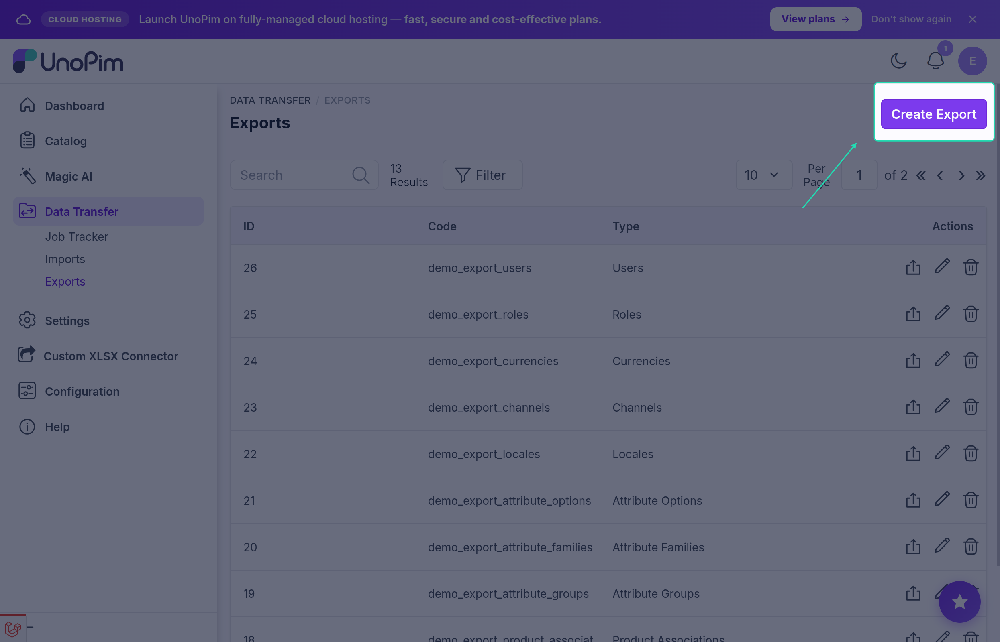
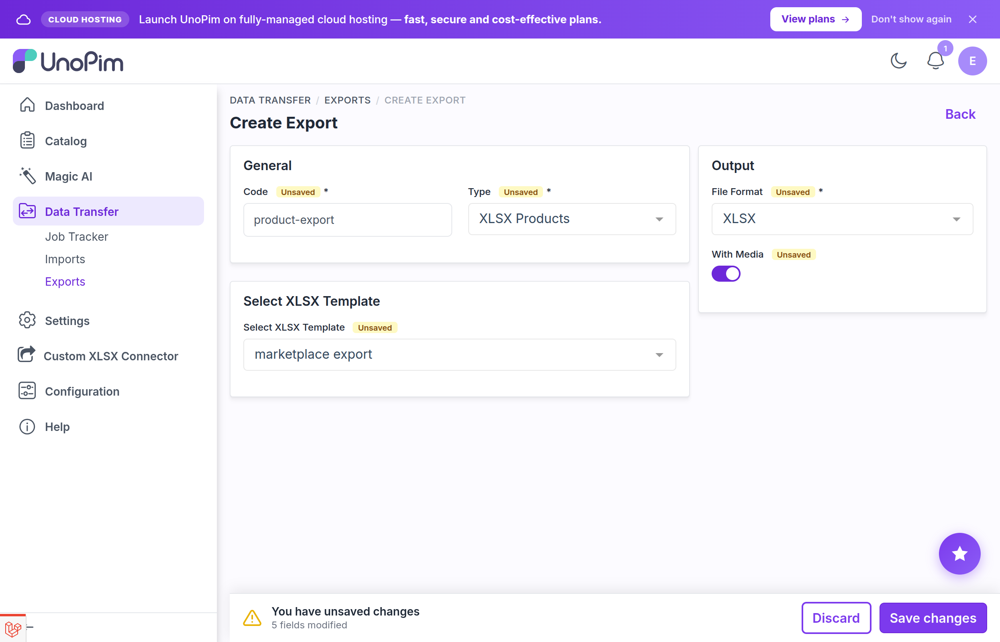

# Export Job — XLSX Products

A **Job Operator** is an admin user who runs export jobs using the Custom XLSX Connector. Operators select a saved mapping template, apply product filters, and run the job. They do not need to author the column mapping themselves.

See the [Author Guide](./author-guide) for template creation (Step 1 of the three-step workflow).

---

## Step 1 — Open the export job form

Navigate to **Data Transfer → Exports → Create**.



## Step 2 — Configure the job

Set the following fields in the job form:

- **Type** — choose **XLSX Products**
- **Filters** — narrow by channel, locale, family, category, or status as needed
- **With Media** — turn on to include images and file attachments in the export archive
- **XLSX Template** — pick the template whose export mapping defines your output columns; only enabled templates appear here

> If no template is selected, the export falls back to standard UnoPim attribute codes as column headers.



## Step 3 — Save and run

Save and click **Run**. The export is dispatched to the queue:

```
Operator clicks Run
        ↓
Job dispatched to the queue
        ↓
Queue worker reads products in batches (cursor-based pagination)
        ↓
Each product is transformed into XLSX columns using the template mapping
        ↓
One row per channel/locale combination per product
        ↓
All currencies written as separate price columns
        ↓
Formula-safe values written to the workbook
        ↓
If With Media is on, media files are copied into the archive
```

## Step 4 — Download the file

When the job completes, click the download link in **Data Transfer → Exports** to retrieve the `.xlsx` file (or a `.zip` archive if **With Media** was enabled).

---

## What each XLSX row contains

Each product generates one row per channel/locale combination. For a catalog with two channels (each with two locales), a single product produces four rows. All rows carry the same SKU and structural fields; the attribute values vary by channel and locale.

| Always present | Notes |
|---|---|
| `channel` | Channel code for this row |
| `locale` | Locale code for this row |
| SKU column | Mapped via the template or the default `sku` column |
| Status column | `true` or `false` |
| Type column | `simple`, `configurable`, or `variant_group` |
| Category column | Comma-separated category codes |
| Family column | Attribute family code |
| Parent column | Parent SKU for variants; empty for top-level products |
| Configurable attributes column | Comma-separated super-attribute codes for configurable products |
| Variant structure column | Variant-structure code for configurable products |

---

## Queue worker

Export jobs are dispatched as queued jobs through UnoPim's Data Transfer pipeline. A queue worker must be running:

```bash
php artisan queue:work
```

If no worker is running, jobs stay in **Pending** and never produce results.

---

## Troubleshooting

### "XLSX Products" not in the type dropdown

- Confirm the package is installed and the service provider is registered.
- Run `php artisan optimize:clear` and reload the page.
- Check that your role includes Data Transfer access.

### Template not visible in the job form

- The template's status is **Disabled** — enable it from **Custom XLSX Connector → Templates**.
- The template may only have an import mapping (not visible in export jobs).
- Confirm your role includes view access to the Custom XLSX Connector (contact your administrator).

### Export produces an empty or incomplete file

- Check the product filters on the export job — they may exclude all products.
- Confirm the template has an **Export Mapping** populated. A template with only an Import Mapping produces no columns on export.
- Check the template's category scope and product-status filter — they may be narrower than expected.
- Ensure a queue worker is running and completed the job without errors.

### Export file opens with formula errors in Excel

This should not happen — all exported values are passed through `EscapeFormulaOperators::escapeValue()`. If you see formula output, confirm you are on connector version `2.0.x` or higher and that the export ran through the XLSX exporter (not a CSV fallback).

### Job is stuck in Pending

- Confirm a queue worker is running: `php artisan queue:work`.
- Check `storage/logs/laravel.log` for queue exceptions.
- Restart the worker after any code change — workers cache class definitions until restart.

---

## Best practices

1. **Open the export in Excel before sharing** — verify column order, headers, and multiselect separators match what the recipient expects.
2. **Keep the same template across recurring runs** — consistent templates make job-history comparison straightforward.
3. **Use With Media for full handovers** — when sending data to an external party, enable **With Media** so the archive is self-contained.
4. **Watch logs on the first run after a template change** — `storage/logs/laravel.log` and the queue worker output show any mapping errors early.
5. **Do not cancel a queued job externally** — once dispatched, the job runs to completion or until the worker is stopped.
