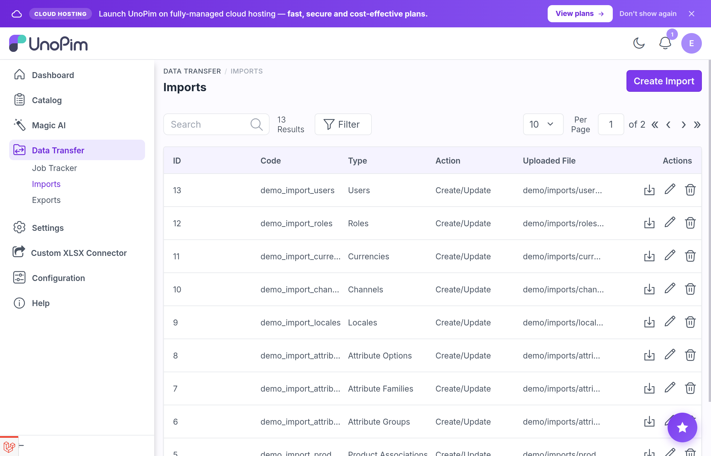
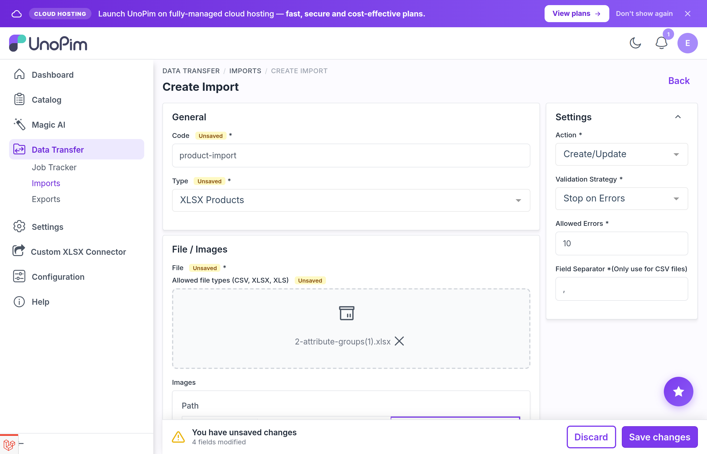

# Import Job — XLSX Products

A **Job Operator** is an admin user who runs import jobs using the Custom XLSX Connector. Operators select a saved mapping template, point it at a file, and run the job. They do not need to author the column mapping themselves.

See the [Author Guide](./author-guide) for template creation (Step 1 of the three-step workflow).

---

## Step 1 — Open the import job form

Navigate to **Data Transfer → Imports → Create**.



## Step 2 — Configure the job

Set the following fields in the job form:

- **Type** — choose **XLSX Products**
- **Update Strategy** — choose whether to create, update, or delete products on import
- **XLSX Template** — pick the template whose import mapping matches the columns in your file; only enabled templates appear here



## Step 3 — Upload the XLSX file

Attach the `.xlsx` file you want to import. Click **Download Sample** to get a reference workbook if you need to verify the expected structure before uploading.

## Step 4 — Save and run

Save the job, then click **Run**. The job is dispatched to the queue:

```
Operator clicks Run
        ↓
Job dispatched to the queue
        ↓
Queue worker reads the XLSX file row by row
        ↓
Each row is validated and transformed using the template mapping
        ↓
Rows outside the template's category or status scope are skipped
        ↓
Products are created or updated; results recorded in job history
        ↓
Super-attribute axes are synced for configurable products
```

## Step 5 — Monitor progress

Open the job from **Data Transfer → Imports**. You will see:

- progress (rows processed / total rows)
- counts of created, updated, and skipped products
- row-level validation errors with the failing column and reason

---

## What each XLSX row contains

Each product generates one row per channel/locale combination. For a catalog with two channels (each with two locales), a single product produces four rows. All rows carry the same SKU and structural fields; the attribute values vary by channel and locale.

| Always present | Notes |
|---|---|
| `channel` | Channel code for this row |
| `locale` | Locale code for this row |
| SKU column | Mapped via the template or the default `sku` column |
| Status column | `true` or `false` |
| Type column | `simple`, `configurable`, or `variant_group` |
| Category column | Comma-separated category codes |
| Family column | Attribute family code |
| Parent column | Parent SKU for variants; empty for top-level products |
| Configurable attributes column | Comma-separated super-attribute codes for configurable products |
| Variant structure column | Variant-structure code for configurable products |

---

## Queue worker

Import jobs are dispatched as queued jobs through UnoPim's Data Transfer pipeline. A queue worker must be running:

```bash
php artisan queue:work
```

If no worker is running, jobs stay in **Pending** and never produce results.

---

## Troubleshooting

### "XLSX Products" not in the type dropdown

- Confirm the package is installed and the service provider is registered.
- Run `php artisan optimize:clear` and reload the page.
- Check that your role includes Data Transfer access.

### Template not visible in the job form

- The template's status is **Disabled** — enable it from **Custom XLSX Connector → Templates**.
- The template may only have an export mapping (not visible in import jobs).
- Confirm your role includes view access to the Custom XLSX Connector (contact your administrator).

### Validation errors on import

Open the job's row-level error panel — each error names the failing column and the reason. Common causes:

- A required attribute (such as `sku`) is not mapped in the template.
- A column in the file is not listed in the template mapping and not recognized as a standard UnoPim column.
- A value violates the attribute's validation rules (wrong type, invalid option code, length limit).
- The row's locale is not enabled on the row's channel.
- The row's categories are outside the template's category scope.
- The row's status does not match the template's product-status filter.

Always validate a small file (5–10 rows) first before running large imports.

### Import skips rows unexpectedly

- **Category scope** — the template has categories selected; rows whose categories do not overlap are skipped.
- **Product-status filter** — the template is set to Enabled or Disabled only; rows with the opposite status are skipped.
- **Channel/locale mismatch** — the row's locale is not enabled on the row's channel.

### Configurable products are missing variant axes after import

The connector syncs super-attribute axes after each import batch. If axes are still missing:

- Check that the `configurable_attributes` column (or the column named in **Family Variant Field**) contains the correct attribute codes.
- Confirm those attribute codes exist in UnoPim under **Configure → Attributes**.
- Review the job's row-level errors for any batch-level failures.

### Job is stuck in Pending

- Confirm a queue worker is running: `php artisan queue:work`.
- Check `storage/logs/laravel.log` for queue exceptions.
- Restart the worker after any code change — workers cache class definitions until restart.

---

## Best practices

1. **Run a sample file first** — 5–10 rows through an import job catches template mismatches cheaply before committing the full catalog.
2. **Keep the same template across recurring runs** — consistent templates make job-history comparison straightforward.
3. **Watch logs on the first run after a template change** — `storage/logs/laravel.log` and the queue worker output show any mapping errors early.
4. **Do not cancel a queued job externally** — once dispatched, the job runs to completion or until the worker is stopped; stopping the worker mid-job leaves the database in a partial state.
