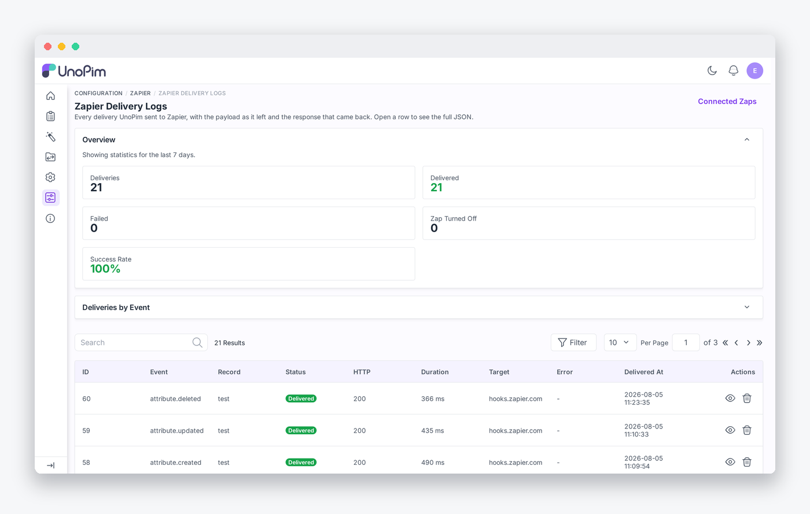
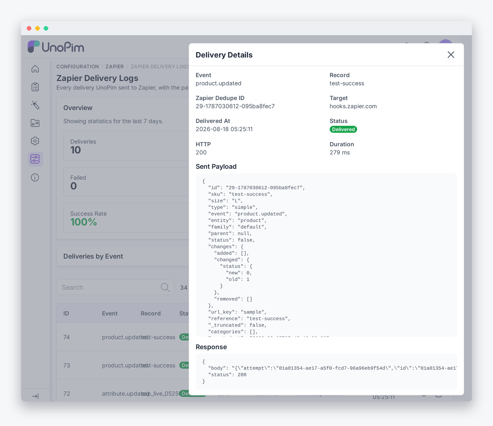

# Connected Zaps and Delivery Logs

Two admin pages, both grouped under **Configuration** in the sidebar.

| Page | Route |
|---|---|
| Connected Zaps | `/admin/zapier` |
| Delivery Logs | `/admin/zapier/logs` |

> [!NOTE]
> The pages sit at `/admin/zapier`, not under `/admin/configuration/`. Core's configuration catch-all route is registered before any package route, so a `configuration/zapier` URL never reaches this package's controller. The sidebar grouping comes from the menu key, not from the path.

---

## Connected Zaps

Every Zap that has subscribed to an event. Zaps appear here on their own when someone switches one on in Zapier, and disappear on their own when it is switched off - there is nothing to create by hand.


| Column | What it shows |
|---|---|
| **ID** | The subscription row id. Also sent on every delivery as `X-Unopim-Subscription-Id`. |
| **Event** | The event key the Zap subscribed to, concrete or wildcard. |
| **Target** | The **host** of the Zap's hook URL, e.g. `hooks.zapier.com`. The full URL is never displayed. |
| **Zap ID** | Zapier's own identifier for the Zap, when it supplied one. |
| **Status** | Active or Inactive. |
| **Health** | **Healthy**, or the last error message if the most recent delivery failed. Cleared automatically on the next success. |
| **Connected On** | When the subscription was created. |

Search by event, target or Zap ID; filter by event, status or connection date.

### Disconnecting a Zap

The list is **read-only apart from a manual disconnect**, because Zapier creates and removes these rows itself. The trash icon exists for the case where a Zap no longer exists on Zapier's side and never sent the 410 that would have cleaned it up.

Disconnecting here removes the subscription only. Delivery history is kept.

---

## Delivery Logs

Every attempt UnoPim made, with what was sent and what came back.



### The overview strip

Five figures for the window: **Deliveries**, **Delivered**, **Failed**, **Zap Turned Off** and **Success Rate**.

The window defaults to the **last 7 days**. Widen it with a query parameter:

```
/admin/zapier/logs?days=30
```

Below it, **Deliveries by Event** breaks the same window down per event key - total, delivered, failed and success rate - so you can see which trigger is actually busy and which one is failing.

### The history grid

| Column | What it shows |
|---|---|
| **ID** | The log row id. |
| **Event** | The concrete event key. Filterable as a dropdown built from the registered event catalog. |
| **Record** | The SKU or code of the record that changed. |
| **Status** | Delivered / Failed / Zap Turned Off / Blocked. |
| **HTTP** | The status code Zapier returned. |
| **Duration** | Round-trip time in milliseconds. |
| **Target** | The destination host. |
| **Error** | The first 60 characters of the error, or `-`. |
| **Delivered At** | Timestamp, filterable as a date range. |

Search on event, record or target. Filter on event, status, HTTP code or date range.

### Statuses

| Status | Meaning |
|---|---|
| **Delivered** | Zapier accepted it and answered 2xx. |
| **Failed** | The endpoint errored, returned a non-2xx that was not 410, or timed out. The job retries. |
| **Zap Turned Off** | Zapier answered **410 Gone**. The Zap is off, so the subscription was removed - the log row stays. |
| **Blocked** | The SSRF guard refused the target, so nothing left your server. |

### Opening a delivery

The eye icon on any row opens **Delivery Details**: the event, the record, the Zapier dedupe id, the target host, the status, the HTTP code, the duration, **the exact JSON payload as it was sent**, and the response that came back.



This is what answers *"why did my Zap not fire"* or *"why is that field empty"* from history, without reproducing the change.

> [!TIP]
> The **Zapier Dedupe ID** shown here is the `id` field Zapier deduplicates on. If two deliveries share one, Zapier accepted the first and silently dropped the second. See [Triggers](./triggers) for how it is built.

---

## Retention

| Setting | Default |
|---|---|
| Rows kept | **30 days** (`ZAPIER_LOG_RETENTION_DAYS`) |
| Keys stored per payload | **60** (`ZAPIER_LOG_MAX_PAYLOAD_KEYS`) |
| Logging on/off | **on** (`ZAPIER_LOGGING`) |

`php artisan zapier:logs:prune` enforces the window and is **registered to run daily** by the package - you only need your Laravel scheduler running. It deletes in bounded chunks of 1,000 rows so a table that has grown large never locks for the whole delete.

Run it by hand, or override the window for one run:

```bash
php artisan zapier:logs:prune
php artisan zapier:logs:prune --days=7
```

Setting `ZAPIER_LOG_RETENTION_DAYS=0` keeps rows forever and makes the command a no-op.

A wide catalog payload can run to hundreds of keys. Storing every one on every attempt would turn this into the largest table in your schema, so a stored payload is capped at `ZAPIER_LOG_MAX_PAYLOAD_KEYS` and marked with `_log_truncated` when the cap bites. This affects only the **stored copy** - the delivery itself carries the full payload.

See [Configuration](./configuration) for all the keys.
