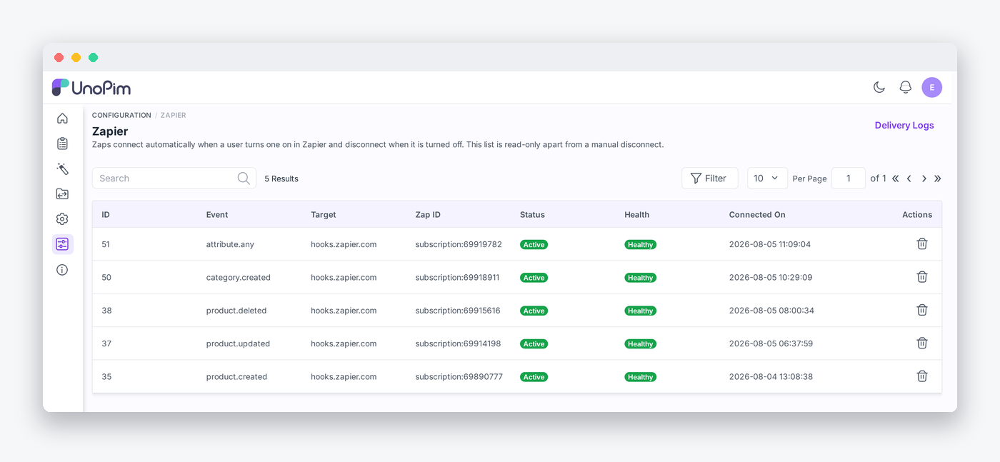

# Installation

This page installs the UnoPim side of the connector. Once it is in place, see [Connect UnoPim in Zapier](./credentials) to start building Zaps.

The connector has two halves:

| Half | What it is | Where it runs |
|---|---|---|
| `packages/Webkul/Zapier` | The PHP package - subscriptions, triggers, delivery logging, admin pages | Inside your UnoPim application |
| `zapier-app` | The Zapier Platform app (Node.js) | On Zapier's servers |

Both are required. The package exposes the endpoints; the Zapier app is what users connect to in the Zap editor. Steps 1-6 below install the package. Step 7 covers deploying the Zapier app, which you only do if you are publishing your own private copy of the integration.

## Steps

### 1. Drop the package in place

Unzip the extension, rename the folder to `Zapier`, and move it into your UnoPim project:

```
packages/Webkul/Zapier/
```

### 2. Register the service provider

In `bootstrap/providers.php`:

```php
use Webkul\Zapier\Providers\ZapierServiceProvider;

return [
    // ...
    ZapierServiceProvider::class,
];
```

> [!NOTE]
> This bootstraps the package's routes, migrations, translations, views, config and event listeners during application startup.

### 3. Register the Concord module

The package also ships a Concord `ModuleServiceProvider`, which registers the `ZapierSubscription` and `ZapierDeliveryLog` models so they can be resolved through proxies and overridden by other packages.

Add it to the `modules` array in `config/concord.php`:

```php
'modules' => [
    // ...
    \Webkul\Zapier\Providers\ModuleServiceProvider::class,
],
```

> [!WARNING]
> Register the Concord module in `config/concord.php`, **not** in `bootstrap/providers.php`. Putting it in the providers list makes the application fail to boot with *"Concord not instantiable"*.

### 4. Add the namespace to composer autoload

In your project's root `composer.json`, under `autoload` → `psr-4`:

```json
"autoload": {
    "psr-4": {
        "Webkul\\Zapier\\": "packages/Webkul/Zapier/src"
    }
}
```

### 5. Run the install commands

In this order:

```bash
composer dump-autoload
php artisan migrate
php artisan optimize:clear
```

| Command | Purpose |
|---|---|
| `composer dump-autoload` | Regenerates Composer's autoloader so the new namespace resolves. |
| `php artisan migrate` | Creates the `zapier_subscriptions` and `zapier_delivery_logs` tables. |
| `php artisan optimize:clear` | Clears cached config, routes, views and bootstrap files so the new package is picked up. |

### 6. Keep a queue worker running

```bash
php artisan queue:work --queue=zapier
```

> [!CAUTION]
> **This step is not optional.** Every delivery is a queued job on the dedicated `zapier` queue. Without a worker on that queue **no trigger ever fires, and nothing on screen says why** - the Connected Zaps page still lists the Zap as Active, and the Delivery Logs page simply stays empty. This is the single most common reason a Zap goes quiet.

In production, keep the worker alive with Supervisor, systemd or Horizon. A minimal systemd unit:

```ini
[Unit]
Description=UnoPim Zapier queue worker
After=network.target

[Service]
User=www-data
Restart=always
WorkingDirectory=/var/www/unopim
ExecStart=/usr/bin/php artisan queue:work --queue=zapier --tries=3 --sleep=1

[Install]
WantedBy=multi-user.target
```

> [!TIP]
> A queue worker loads your code once at startup. After upgrading the package, restart the worker with `php artisan queue:restart` or it keeps running the previous version. Do not run two workers on the same queue with different code - whichever grabs a job first wins, and the results look random.

### 7. Deploy the Zapier app (optional)

Skip this if you are connecting to the published **UnoPim** integration in Zapier's app directory. Do it if you are running your own private copy.

Requires **Node 22 or newer** and npm 10 or newer:

```bash
cd zapier-app
npm install
npm install -g zapier-platform-cli
zapier-platform login
zapier-platform register "UnoPim"
npm run push
```

> [!NOTE]
> The CLI binary is `zapier-platform`, not `zapier` - it was renamed in v18. If you get `zapier: command not found`, you used the old name.

The integration now appears in your Zapier account as a private app.

## Check it worked

1. **Menu shows up.** Open the admin panel - a **Zapier** entry appears under **Configuration** in the sidebar, pointing at `/admin/zapier`.

2. **Both admin pages load.**

   | Page | Route |
   |---|---|
   | [Connected Zaps](./delivery-logs) | `/admin/zapier` |
   | [Delivery Logs](./delivery-logs) | `/admin/zapier/logs` |

   

3. **The connection endpoint answers.** With an API key in hand (see [Connect UnoPim in Zapier](./credentials)), `GET /api/v1/rest/zapier/me` returns your instance name, URL, default locale and default channel.

4. **The worker is alive.** `php artisan queue:work --queue=zapier` is running and stays running.

5. **Log pruning is scheduled.** `php artisan zapier:logs:prune` is registered to run daily. Confirm your scheduler is wired up:

   ```bash
   php artisan schedule:list
   ```

## Give your role permission

Open **Settings → Roles**, edit the role, and tick the Zapier permissions you want:

| Permission | Grants |
|---|---|
| **Zapier** | Open the Connected Zaps page. |
| **Delete** | Manually disconnect a Zap from the Connected Zaps grid. |
| **Delivery Logs** | Open the Delivery Logs page and view a single delivery. |
| **Delete Logs** | Delete a delivery log row. |

Without these the menu entry and the row actions stay hidden.

The API key used by Zapier needs its own permissions too, granted on the key itself under **Configuration → Integrations**:

| API permission | Used for |
|---|---|
| **Zapier** | The connection test (`me`). |
| **Subscriptions** | Listing subscriptions. |
| **Create** | `performSubscribe` - registering a Zap. |
| **Delete** | `performUnsubscribe` - removing a Zap. |
| **Triggers** | The sample endpoint behind Zapier's *Test trigger* step. |

Setting the key's **Permission Type** to *All* covers every one of them.

If any of this does not work, see [Troubleshooting](./troubleshooting) or [Contact Support](./contact-support).
